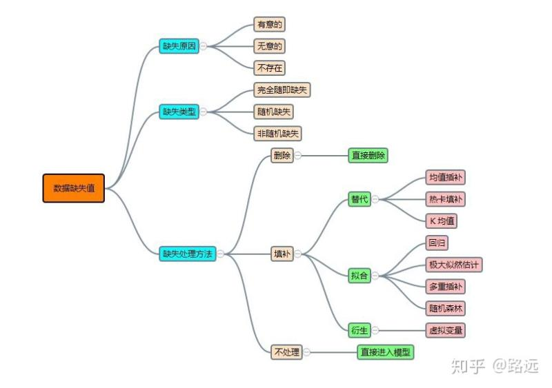

## Task1：数据分析

爱因斯坦，牛顿之所以伟大因为他们不是一个人在战斗，他们都有着良好氛围的圈子，可以分享讨论观点。所以伟大从参加讨论开始~~~

### 1&emsp;问题讨论

**因为本次任务是基础的数据预处理和数据集划分，所以本次讨论不涉及特征工程和模型相关的。**

**【问题一 缺失数据】**

 - 参考文献：[Python数据分析基础: 数据缺失值处理](https://juejin.im/post/5b5c4e6c6fb9a04f90791e0c)

 - Q1：为什么需要处理缺失值？

   答：就如同一件喜欢的衣服上有洞的情况一样，洞小、洞少情况下舍不得扔，打打补丁不影响美观的情况下还可以继续穿。但若洞大洞多了，没法穿或穿出去被围观，就只能忍痛仍了缺失值的缺失率和重要性，以及不同缺失值的处理方式在一定程度上影响了特征提取、建模和模型训练缺失值太多，可以尝试着直接删除，如果不删除，处理不好，可能会引来噪声缺失值较少，少于某一缺失率时，直接删除又会带来信息的损失，此时可以采取适当的填充方式

 - Q2：缺失率大于多少时应当抛弃该特征？
 
   答：一般为70%,但是还要分析该特征与训练目标的重要程度

 - Q3：缺失值填充有哪些方法？
 
 

 - Q4：采用各种填充方法的影响或者优缺点？
 
   答：平均值：大大降低数据的方差，即随机性

 - Q5：需要依据什么样的准则去选择合适的方法？
 
   答：
   
   - 删除：如果行和列的缺失达到一定的比例，建议放弃整行或整列数据

   - 补全统计法：对于数值型的数据，如果是连续性，就使用平均值插补，如果是离散性，就使用中位数、众数补足；对于分类型数据，使用类别众数最多的值补足。

   - 模型法：更多时候我们会基于已有的其他字段，将缺失字段作为目标变量进行预测，从而得到最为可能的补全值。如果带有缺失值的列是数值变量，采用回归模型补全；如果是分类变量，则采用分类模型补全。

   - 专家补全：对于少量且具有重要意义的数据记录，专家补足也是非常重要的一种途径。

   - 真值转换：该思路的根本观点是，我们承认缺失值的存在，并且把数据缺失也作为数据分布规律的一部分，这将变量的实际值和缺失值都作为输入维度参与后续数据处理和模型计算。但是变量的实际值可以作为变量值参与模型计算，而缺失值通常无法参与运算，因此需要对缺失值进行真值转换。

   - 很多模型对于缺失值有容忍度或灵活的处理方法，因此在预处理阶段可以不做处理。常见的能够自动处理缺失值的模型包括：KNN、决策树和随机森林、神经网络和朴素贝叶斯、DBSCAN

**【问题二 数据探索】**

 - Q：对于字段较少的情况下经常使用绘图来更直观的观察数据的分布，进而对数据进行针对性的处理；但是再字段量较多的情况下一个一个字段去绘图会比较费时间，那应该用怎么的顺序逻辑对字段进行处理？

   答：我采取的方式是首先去判断哪些字段值重复率较高，这个通过sql语句group by可以直接看出来。其次把数据通过spss对每一个特征进行分析，是绘图还是简单的分析，软件里面都有提供，基本上通过上面两步保证百分之七八十吧，如果仅仅是是在数据探索阶段的话，基本上就完成了

**【问题三 时间序列】**

 - Q：时间序列应该怎么处理？除了提取天数还能做什么处理？
 
   答：通过绘图，查看结果的周期型变化，构造不同的时间维度出来，年月日周小时等；或者也可以自己构造一个时间段出来（聚类）。

**【问题四 异常值和离群值】**

 - Q1：怎样判断离群值以及是否需要删除离群值或怎样替代离群值？（比如一些手动录入过程中出错产生的离群值等）
 
   答：
   
   - 基于统计：BPrule 算法、3倍绝对中位差、分位数等；
   
   - 基于近邻性：基于距离（Index-Based 算法、Nested-Loop 算法、Celi-Based 算法）；基于密度（LOF 算法、LSC算法）等；
   
   - 基于聚类方法、基于分类算法：大部分聚类、分类算法均可
 
 - Q2：为什么要处理离群值？
 
 &emsp;&emsp;答：大多数的参数统计值，如均值、标准差、相关系数等，以及基于这些参数的统计分析，均对离群值高度敏感。

**【问题五 分类数据的编码】**

 - 参考资料：[处理高基数单类别变量的方案](https://mp.weixin.qq.com/s/U93vvFwZ8vSJuswk24yc6w)

 - Q1：对于各种离散型特征，如何进行编码？有哪些方法？以及为啥需要编码？
 
 - Q2：类别数据需要进行不同的编码，那么数值型数据呢？需要做什么处理？

**【问题六 数据不平衡问题】**

 - 参考文献：[机器学习中如何处理不平衡数据？](https://www.jiqizhixin.com/articles/021704)

 - Q：如何处理数据不平衡的问题？(主要是指标签列的类别间不平衡)
 
   答：1. 改变数据量的大小，使类别间变得平衡；2. 不改变数据量大小，设置成本矩阵或代价函数来进行限定。
 
   策略：

   - 扩大数据集。以期得到更多的分布信息；同时扩大数据量后也方便后面的重新采样。
  
   - 尝试新角度理解问题。我们可以把那些小类的样本作为异常点(outliers)，因此该问题便转化为异常点检测(anomaly detection)与变化趋势检测问题(change detection)。异常点检测即是对那些罕见事件进行识别。如通过机器的部件的振动识别机器故障，又如通过系统调用序列识别恶意程序。这些事件相对于正常情况是很少见的。变化趋势检测类似于异常点检测，不同在于其通过检测不寻常的变化趋势来识别。如通过观察用户模式或银行交易来检测用户行为的不寻常改变。

   1. Sampling methods(采样方法)
   
      **增加偏少的类别 - OverSampling过采样**
      
      ① 简单随机重复。
      
      ② SMOTE。在相同边界内，人工造数据。
      
      **减少偏多的类别 - UnderSampling欠采样**
      
      ① 简单随机抽样。
      
      ② 带边界清理。尽量保留分布信息。
      
   2. 引入不同的评价指标
   
      由于正确率太过片面。可以通过G-Mean指标，特别是ROC曲线（接受者工作特征曲线-Receiver Operating Characteristic Curve）和AUC曲线下面积。
   3. Cost-sensitive methods(代价敏感学习方法)
   
      代价敏感学习方法的核心要素是代价矩阵，我们注意到在实际的应用中不同类型的误分类情况导致的代价是不一样的，例如在医疗中，“将病人误疹为健康人”和“将健康人误疹为病人”的代价不同；在信用卡盗用检测中，将盗用误认为正常使用”与“将正常使用识破认为盗用”的代价也不相同。
      
   4. 采用集成学习思想。
   
      把多数类进行划分，然后和少数类组合成多个小的训练集，然后生成学习器，最后再集成。
 
### 2&emsp;笔记

 - 一般而言，在保证测试集和训练集分布一致的情况下，先划分数据集再进行数据预处理（这个保证也有可能是个坑）
 
 - 数据建模时，本质上是计算类别中的距离，离散型特征是否存在距离决定了我们该用什么方式编码
 
 - 欠采样、过采样（上采样、下采样）与 SMOTE
 
